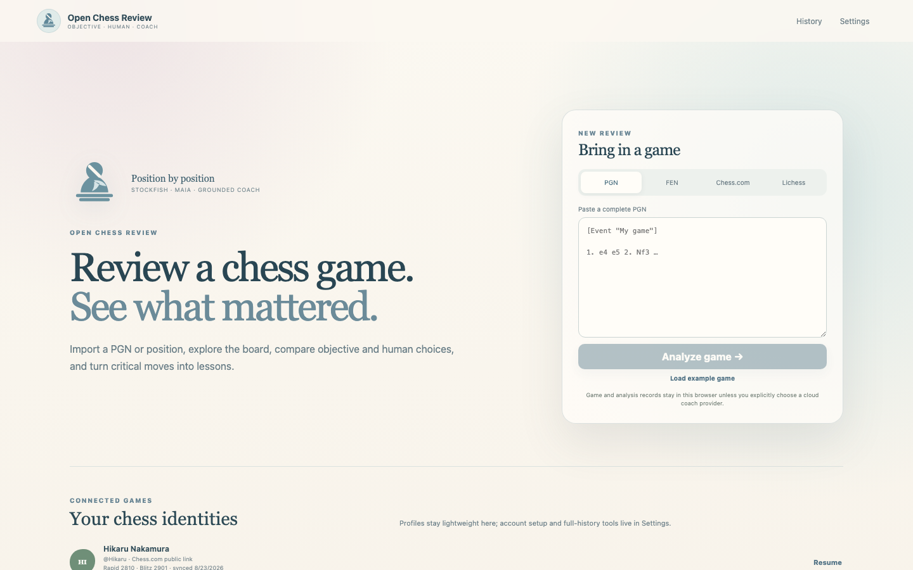
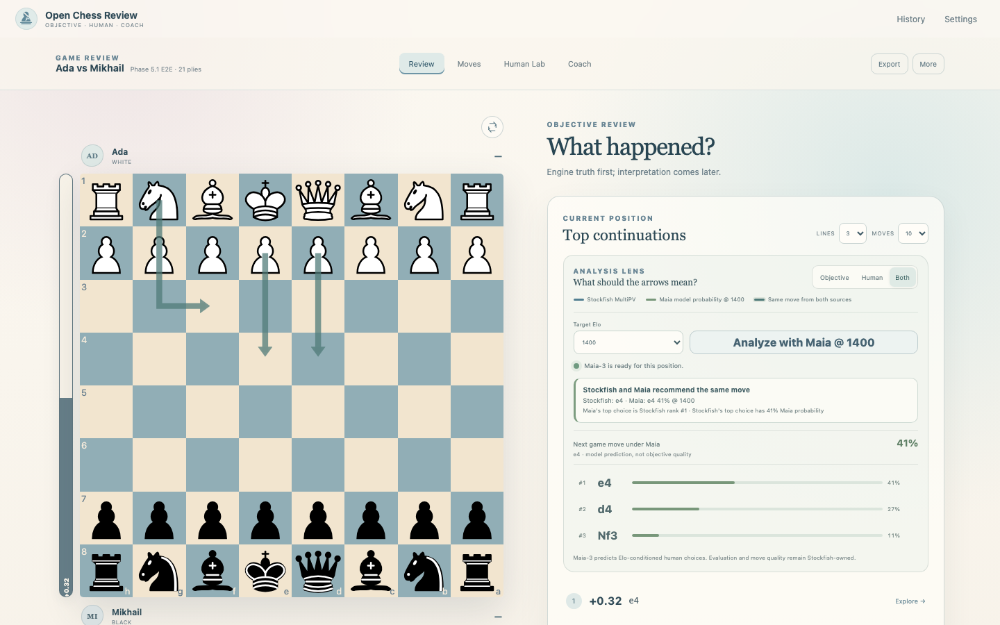

# Open Chess Review

Open Chess Review is an open-source chess game review and coaching workspace. It combines canonical Stockfish analysis, Elo-conditioned Maia-3 move prediction, and a grounded language coach without blurring the responsibility of those three layers.



## What it does

- Imports PGN games and explicit FEN positions.
- Runs Stockfish 18 WASM in the browser for evaluation, MultiPV, classifications, Accuracy, phases, openings, critical moments, and legal analysis variations.
- Compares objective candidates with optional Maia-3 human move probabilities at a chosen target Elo.
- Produces on-demand coaching from structured facts and validated engine lines, with deterministic copy when the language provider is unavailable.
- Syncs complete public Chess.com archives and authorized Lichess game history into a local IndexedDB library with resumable checkpoints.
- Exports annotated PGN, canonical JSON, position PNGs, and game-review PNGs.



## Architecture

```text
Stockfish objective truth ─┐
                          ├─> versioned canonical facts ─> review / cache / export
Maia human prediction ────┘                 │
                                            └─> grounded Coach explanation
```

Stockfish owns objective chess claims. Maia predicts human choices and never replaces evaluation or move quality. The Coach explains supplied evidence and cannot override engine or rules-layer facts.

The pnpm workspace keeps those boundaries explicit:

| Area | Responsibility |
| --- | --- |
| `apps/web` | Next.js routes, browser UX, review orchestration, IndexedDB and connected platforms |
| `packages/chess-core` | PGN/FEN normalization, legal replay and deterministic chess primitives |
| `packages/analysis` | WinPercent, Accuracy, game phases, classification, tactics and Coach facts |
| `packages/stockfish` | Stockfish transport, UCI parsing, cache identity and worker integration |
| `packages/openings` | Lichess opening data and position-based recognition |
| `packages/shared` | Versioned schemas shared across browser, analysis and service boundaries |
| `packages/ui` | Original Blue Bishop identity and reusable move-quality marks |
| `services/local-ai` | Optional FastAPI Maia and provider-neutral grounded Coach adapters |
| `apps/desktop` | Phase 6 Vite/React/Tauri 2 native shell; it imports shared packages and owns no analysis semantics |

See [docs/architecture.md](docs/architecture.md) and [docs/data-model.md](docs/data-model.md) for the detailed contracts.

## Runtime modes

| Mode | Command | Available capabilities |
| --- | --- | --- |
| Browser Core | `pnpm dev:web` | PGN/FEN, Stockfish WASM, review, variations, Accuracy, openings, charts, library and exports |
| Enhanced Local | `pnpm dev` | Browser Core plus managed/reused FastAPI, Maia-3, Ollama discovery and grounded local coaching |
| Services only | `pnpm dev:local-ai` | Starts or reuses optional services for a separately running web app |

`pnpm dev` is the normal full-development entry point. It reuses healthy services, starts only missing executables, and stops only processes it owns. Ollama is started with `ollama serve`; no model is downloaded automatically. `pnpm dev:check` reports runtime availability without starting anything.

The web product remains fully usable when local-ai is offline. In that state Stockfish continues in the browser, Maia controls show an explicit offline state, and Coach requests use deterministic canonical copy.

## Setup

Requirements:

- Node.js 22 or newer (CI uses Node.js 24)
- pnpm 11.19.0 through the repository `packageManager` declaration
- A modern browser with Web Workers and IndexedDB
- Optional: Python 3.12+, [uv](https://docs.astral.sh/uv/), Ollama, and Maia-compatible local resources

Install JavaScript dependencies and start Browser Core:

```bash
pnpm install --frozen-lockfile
pnpm dev:web
```

For Enhanced Local Mode, prepare the Python service and use the managed launcher:

```bash
uv sync --project services/local-ai --extra dev --locked
pnpm dev
```

Maia-3 is deliberately optional because its runtime is substantially heavier:

```bash
uv sync --project services/local-ai --extra dev --extra maia --locked
```

If the configured Ollama model is absent, the launcher prints the exact `ollama pull` command but waits for explicit approval before any download. The default model and provider environment variables are documented in [docs/ai-coach.md](docs/ai-coach.md).

## Connected platforms

- Chess.com uses its public Published Data API. Username links are labelled unverified because they do not prove account ownership.
- Lichess uses OAuth 2 Authorization Code + PKCE with `S256`. Configure `LICHESS_CLIENT_ID` and `LICHESS_SESSION_SECRET` in `apps/web/.env.local` from `apps/web/.env.example`.
- Sync stores game metadata and PGN first. It never starts Maia or Coach in bulk, and automatic objective analysis is off by default.

Tokens stay in encrypted, server-only HttpOnly cookies. Imported games and review results stay in the browser's IndexedDB unless the user explicitly selects an external Coach provider. See [docs/connected-platforms.md](docs/connected-platforms.md).

## Development and validation

```bash
pnpm typecheck
pnpm lint
pnpm test
pnpm build
pnpm test:e2e
uv run --project services/local-ai --extra dev pytest services/local-ai/tests
```

Playwright uses deterministic IndexedDB fixtures and network mocks; its critical workflows do not require Chess.com, Lichess, Maia, Ollama, or an API key. Update reviewed screenshot baselines only after intentional visual changes:

```bash
pnpm test:e2e:update
```

The GitHub Actions workflow caches pnpm and uv dependencies, runs TypeScript and Python checks, verifies the production web build, and executes the critical browser workflows without live external services. More detail is in [docs/testing.md](docs/testing.md).

## Product constraints

- Internal engine scores are normalized to White point of view.
- Accuracy follows the documented Lichess-derived WinPercent algorithm, not a mean of move scores.
- Opening/middlegame/endgame division is structural; it is separate from opening-theory recognition.
- Every move classification carries machine-readable evidence.
- Screenshot/OCR position import is intentionally outside the roadmap. PNG export is supported.

Current implementation status and acceptance gates live in [docs/roadmap.md](docs/roadmap.md). Contribution work should also follow [AGENTS.md](AGENTS.md).

The desktop foundation and native build commands are documented separately in
[docs/desktop.md](docs/desktop.md).
