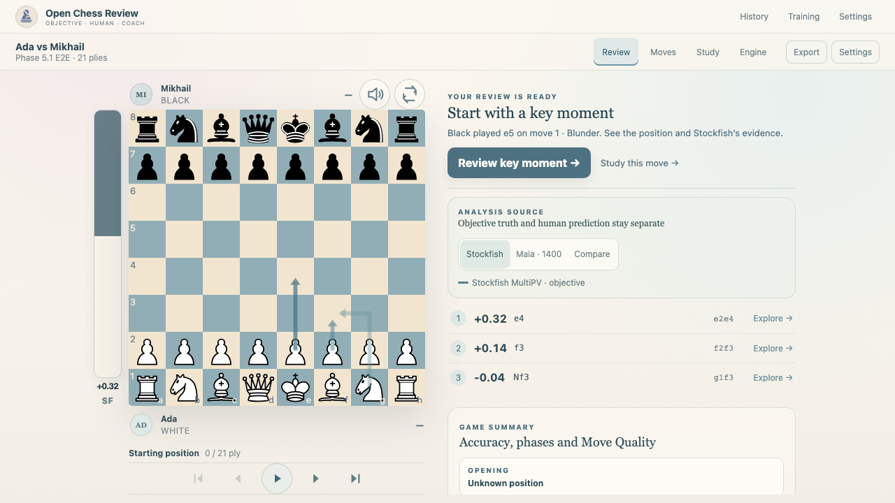
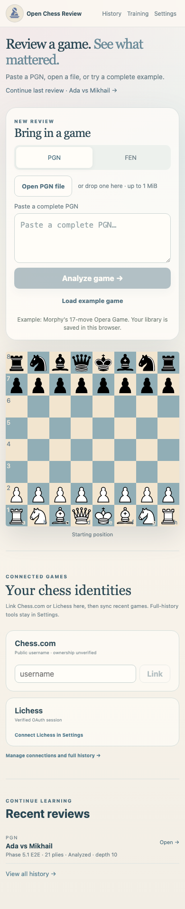

# R2 首页、复盘布局与 PGN 导入验收

日期：2026-09-06。基线：R1 完成后的工作区，HEAD `a1f603e`。
本记录仅描述 R2；R1 的未提交修改继续保留。
状态：R2 已完成本地验收，尚未部署。

## 实际改动

1. Home 压缩重复品牌与大标题占用，提供继续最近复盘入口。PGN/FEN
   表单在手机与键盘顺序中先于装饰棋盘；桌面仍保持棋盘左、输入右。
2. Review 压缩标题区，将翻转、静音与上方玩家放在同一行；按屏幕高度
   和宽度共同分配棋盘与右栏。Game Summary timeline 继续留在右侧，
   桌面右栏可滚动，手机回到正常文档滚动。
3. 提高复盘、Maia、Study 的辅助字号，扩展首页入口、棋盘导航与主要
   学习按钮的点击区域。修正 Moves 面板高度及增大字号后的表头间距。
4. 新增 `.pgn` 选择和拖放，支持粘贴/文件中的多盘选局；限制单文件
   1 MiB、100 盘，全部验证后明确选择一盘。坏文件不覆盖已有输入。
5. Export 增加 Original PGN，保留原评论、NAG、变例及文本换行；菜单
   解释与 Annotated PGN 的区别。旧记录有兼容回退，FEN 不显示此项。
6. 示例换成完整的 33-ply Opera Game。完成分析后提供关键一步与 Study
   入口，直接消费已有关键时刻和事实；无关键时刻时显示普通探索入口。
   探索分支明确提示 Temporary variation · not saved。

导入、导出、示例来源与兼容规则见 [PGN 行为说明](../pgn-import-export.md)。
棋子、棋盘颜色、全站色彩 token、品牌 SVG、V3 图标和棋类算法没有改动。
本批没有新增生产依赖、数据库版本或分析版本。

## 尺寸实测

隔离的 Chromium 测试浏览器；本地 Next 开发服务。Home 含一条最近
复盘记录，Review 使用同一个隔离视觉 fixture。数值为 CSS px，取整。
“导航底部”为棋盘下方 First / Previous / Play / Next / Last 的下边界。

| 视口 | R1 棋盘 | R2 棋盘 | R1 → R2 导航底部 | R2 首页 Analyze 底部 |
| --- | ---: | ---: | ---: | ---: |
| 1280×720 | 330 | 424 | 741 → 708 | 611 |
| 1366×768 | 378 | 472 | 789 → 756 | 613 |
| 1440×900 | 510 | 540 | 921 → 824 | 613 |
| 1920×1080 | 520 | 600 | 931 → 884 | 613 |
| 390×844 | 328 | 328 | 723 → 664 | 605 |
| 320×740 | 258 | 258 | 653 → 630 | 692 |

1280×720 的右栏由约 815px 缩至 514px；棋盘与导航完整进入首屏。
1366×768 实测为 472px，稍高于草案 420–460px 的建议区间，并仍能容纳
两位玩家与导航。六个尺寸均无页面横向溢出；窄屏首页表单位于棋盘前。
这些是指定视口与 fixture 的结果，不代表任意标题长度或设备已经验收。

[六组实际页面截图](assets/r2/index.html) · [原始测量 JSON](assets/r2/measurements.json)

截图中的 Ada / Mikhail 与着法标签是隔离视觉 fixture，用于检查展示，
不能当成这盘棋的真实分析。完整 Opera Game 的功能测试运行真实
Stockfish WASM，并验证最终将死、关键一步导航与 Study 事实。

## 验证

- `pnpm test`：292 项仓库单元测试通过，其中 Web 178 项。
- `pnpm --filter @chess-review/web exec vitest run src/lib/pgn-import.test.ts`：
  14 项输入边界、源文本保留及完整示例回归通过。
- `pnpm typecheck`、`pnpm lint`：通过。
- Playwright：原工作流 29 条、R1 7 条、R2 7 条、六尺寸布局 1 条、
  代表性视觉状态 1 条，共 45 条通过。截图更新后已按普通对比模式
  完成最终验收（`pnpm test:e2e e2e/workflows.spec.ts e2e/r1.spec.ts
  e2e/r2.spec.ts e2e/r2-layout.spec.ts e2e/visual.spec.ts`）。
- `pnpm build`：通过，包含 Web production build。
- `git diff --check`：通过；复核 R2 相对 R1 的差异，确认没有新增
  棋子/品牌/图标资源、调色板字面值或 reference 仓库文件。

R2 浏览器覆盖文件选择、拖放、明确选局、非法文件、保真下载、真实
示例分析、关键一步、Study 事实、临时分支返回、键盘顺序及文字回流。
文字放大测试将视口设为 720px，并将非棋盘文本的渲染字号放大两倍；
这是 1440px 屏幕在 200% 下的回流与文字放大模拟，不是原生浏览器
缩放或真实手机系统字号验收。

CI 的 browser-workflows 已加入 R2 功能和布局断言；本地视觉基线逐张
复核后更新。没有通过降低断言标准、修改棋类 fixture 预期来消除失败。
Moves 的旧高度断言保留，并增加选中着法后证据区域没有超出面板的检查。

## 仍在后续批次的工作

R3：真实逐局面学习进度、继续任务及版本化备份/恢复。R4：Hosted /
Local 能力表达、公开接口运行限制与真实授权。R5：生产模式 E2E、
Firefox/WebKit、真实手机、公开 HTTPS 与大型棋库性能验收。

本批未部署网站，没有修改用户存量棋库，也没有安装或下载 AI 模型。
原始 PGN 导出不等于完整棋库备份，临时分支仍不持久化。
